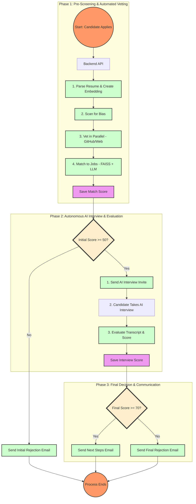

# AI-Powered Recruiting & Talent Screening System

A fully functional, production-ready AI recruiting system powered by multi-agent architecture, featuring automated resume parsing, intelligent candidate matching, interview scheduling, and compliance monitoring.

<div align="center">
  
  
  
</div>

<div align="center">
  
  
  
</div>

## 🏗️ Architecture

### Multi-Agent System (Hierarchical Pattern)
---

## ✨ Core Features

- 🧠 **Multi-Agent Architecture**: Powered by CrewAI, the system uses a team of specialized agents (Orchestrator, Parsing, Matching, Interviewer, etc.) working together under a Master Control Protocol (MCP) to manage a robust, sequential workflow.

- 🎯 **Intelligent Job Matching**: Goes beyond keywords. Uses a two-stage process combining the speed of FAISS vector similarity search with the deep contextual understanding of Llama 3 to score candidates with high accuracy.

- 🤖 **Autonomous AI Interviews**: Shortlisted candidates are invited to a real-time, conversational interview conducted by an AI. The system handles question generation, speech-to-text (via Whisper), and final evaluation.

- 👁️ **AI-Powered Proctoring**: The interview room uses client-side AI (face-api.js) to monitor the candidate's video feed, ensuring a fair and focused assessment environment by detecting multiple people.

- 🚀 **Proactive Sourcing**: When a new job is posted, a dedicated Sourcing Agent automatically scans the entire database of past candidates (within the last year) to find and re-engage qualified talent.

- ⚖️ **Built-in Compliance**: A Compliance Agent scans every resume for potentially biasing information (related to age, gender, ethnicity) and logs a risk report, promoting fair and equitable hiring practices.

- 🌐 **Full-Stack Application**: Features a clean, responsive frontend dashboard and a powerful FastAPI backend, ready for deployment.

- 🔗 **Automated Ingestion**: Seamlessly processes new candidates from a manual resume upload feature or via a connected Google Form.

---

## 📊 System Workflow


---

## 🛠️ Technology Stack

The project is built on a modern, scalable, and cost-effective tech stack.

### Backend
- **Language:** Python
- **Framework:** FastAPI, Uvicorn
- **Agentic Framework:** CrewAI
- **AI Models:**
  - **LLM:** Groq (Llama 3)
  - **Speech-to-Text:** `faster-whisper`
  - **Embeddings:** `sentence-transformers`
- **Databases:** MongoDB (Primary), FAISS (Vector Search)

### Frontend
- **Core:** HTML5, CSS3, Vanilla JavaScript
- **Browser APIs:** Fetch, WebSockets, MediaRecorder, SpeechSynthesis
- **AI Proctoring:** `face-api.js` (Client-Side)

### Deployment & Infrastructure
- **Frontend:** Vercel
- **Backend:** Render (Recommended for WebSocket support)
- **Database:** MongoDB Atlas
- **Development Tunneling:** `ngrok`

---

## 🚀 Getting Started

Follow these steps to get the application running on your local machine.

### Prerequisites

- Python 3.11+
- MongoDB installed and running locally, or a MongoDB Atlas cluster
- A Groq API Key
- Git

### 1. Clone the Repository
```bash
git clone https://github.com/your-username/agentic-ai-hr-system.git
cd agentic-ai-hr-system
```

### 2. Set Up the Backend

#### Create and activate a virtual environment:
```bash
python -m venv recruit_venv

# On Windows
recruit_venv\Scripts\Activate

# On macOS/Linux
source recruit_venv/bin/activate
```

#### Install dependencies:
```bash
pip install -r requirements.txt
```

#### Configure environment variables:

Create a file named `.env` in the root directory and add the following:
```env
GROQ_API_KEY="your_groq_api_key"
MONGODB_URI="mongodb://localhost:27017"  # Or your MongoDB Atlas connection string
FRONTEND_URL="http://127.0.0.1:5500"

# Add any other secrets like email passwords, etc.
```

#### Run the backend server:
```bash
python main.py
```

The server should now be running on `http://localhost:8000`.

### 3. Set Up the Frontend

#### Download Face-API Models:

The client-side proctoring requires pre-trained models. Create a `models` folder inside the `frontend` directory and place the necessary `face-api.js` model files there.

#### Serve the frontend:

**Option 1 - Using VS Code:**
- Install the "Live Server" extension
- Right-click on `frontend/index.html`
- Choose "Open with Live Server"

**Option 2 - Using Python:**
```bash
python -m http.server 5500
```

Then, open your browser and navigate to `http://127.0.0.1:5500/frontend/`.

The application dashboard should now be live and connected to your local backend.

---

## 📁 Project Structure
```
agentic-ai-hr-system/
├── backend/
│   ├── agents/              # CrewAI agent definitions
│   ├── crews/               # Crew configurations
│   ├── tools/               # Custom tools for agents
│   ├── models/              # Data models
│   ├── routes/              # API endpoints
│   └── utils/               # Utility functions
├── frontend/
│   ├── index.html           # Dashboard
│   ├── interview.html       # AI Interview Room
│   ├── css/                 # Stylesheets
│   ├── js/                  # JavaScript files
│   └── models/              # face-api.js models
├── requirements.txt
├── main.py                  # FastAPI application entry point
├── .env.example
└── README.md
```

---

## 🎯 Usage

### For Recruiters

1. **Post a Job**: Navigate to the "Jobs" section and create a new job posting with requirements
2. **Upload Resumes**: Use the upload feature or connect a Google Form for automatic ingestion
3. **Monitor Progress**: Watch as the AI agents automatically process candidates through each phase
4. **Review Results**: Check the dashboard for candidate scores, interview transcripts, and hiring recommendations

### For Candidates

1. **Apply**: Submit your resume through the application portal or Google Form
2. **Automated Vetting**: Your profile is automatically parsed, vetted, and matched to relevant positions
3. **AI Interview**: If shortlisted, receive an email invitation to complete an AI-powered interview
4. **Get Feedback**: Receive automated communication about your application status

---

## 🔒 Security & Privacy

- All candidate data is stored securely in MongoDB
- Client-side proctoring respects user privacy (no video recording, only real-time analysis)
- Compliance agent helps ensure fair hiring practices
- API authentication can be easily added for production deployments

---

## 💡 Future Enhancements

This platform is built to be extensible. Future work could include:

- **Parallel Vetting Crew**: Adding agents to scrape LinkedIn and GitHub profiles in parallel for a richer candidate profile
- **Advanced Analytics**: Building out the dashboard with more charts, such as skills distribution and time-to-hire metrics
- **Human-in-the-Loop**: Adding a stage for a human recruiter to approve or reject an AI's decision before the final email is sent
- **Hybrid Interview Flow**: For high-scoring AI interviews, automatically schedule a final-round human interview using the calendar tool
- **Multi-language Support**: Expand the interview system to support candidates in multiple languages
- **Integration Marketplace**: Connect with popular ATS systems, LinkedIn Recruiter, and other HR tools

---

## 🤝 Contributing

Contributions are welcome! Please feel free to submit a Pull Request. For major changes, please open an issue first to discuss what you would like to change.

1. Fork the repository
2. Create your feature branch (`git checkout -b feature/AmazingFeature`)
3. Commit your changes (`git commit -m 'Add some AmazingFeature'`)
4. Push to the branch (`git push origin feature/AmazingFeature`)
5. Open a Pull Request

---

## 📄 License

This project is licensed under the MIT License - see the [LICENSE](LICENSE) file for details.

---

## 👥 Authors

- **Your Name** - *Initial work* - [YourGitHub](https://github.com/your-username)

---

## 🙏 Acknowledgments

- CrewAI for the powerful multi-agent framework
- Groq for fast LLM inference
- The open-source community for the amazing tools that made this possible

**Built with**: CrewAI, FastAPI, Groq, MongoDB, FAISS, LlamaIndex

**Architecture**: Hierarchical Multi-Agent System with MCP

**Status**: Production Ready ✅
